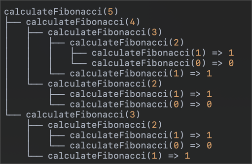
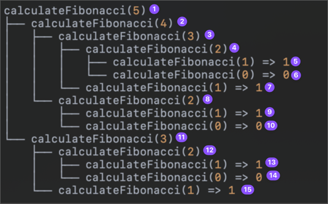
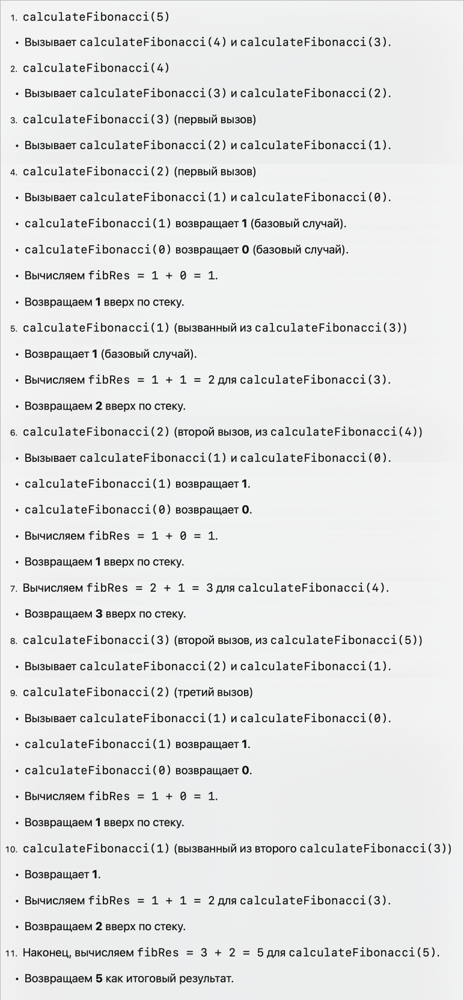
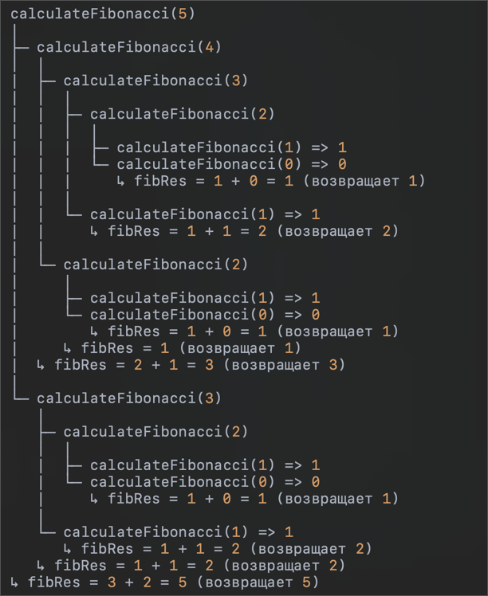
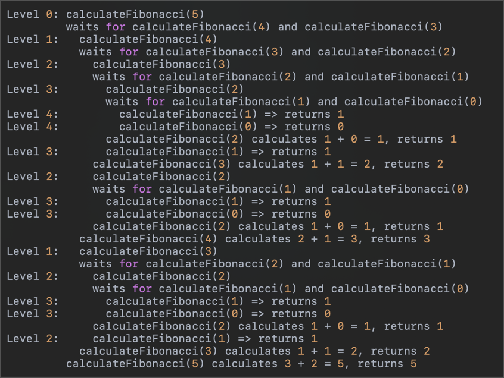

```js
const calculateFibonacci = (n) => {
  const BASE_CASE = n < 2;

  if (BASE_CASE) {
    return n;
  }

  const fibRes1 = calculateFibonacci(n - 1);
  const fibRes2 = calculateFibonacci(n - 2);
  const fibRes = fibRes1 + fibRes2;

  return fibRes;
};

calculateFibonacci(5);
```



 
